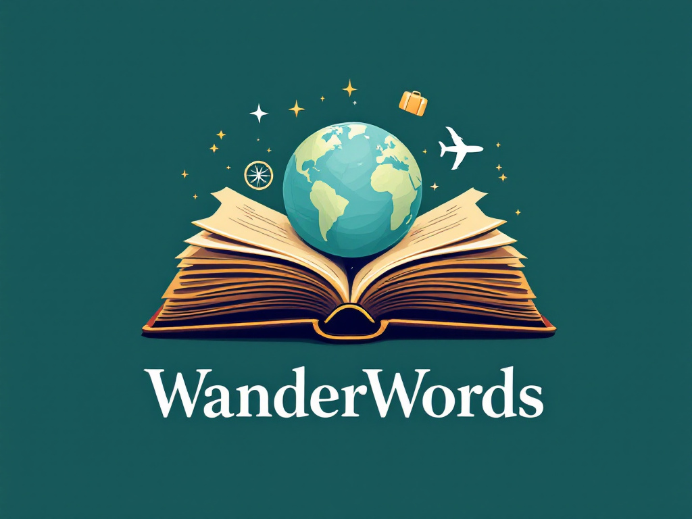
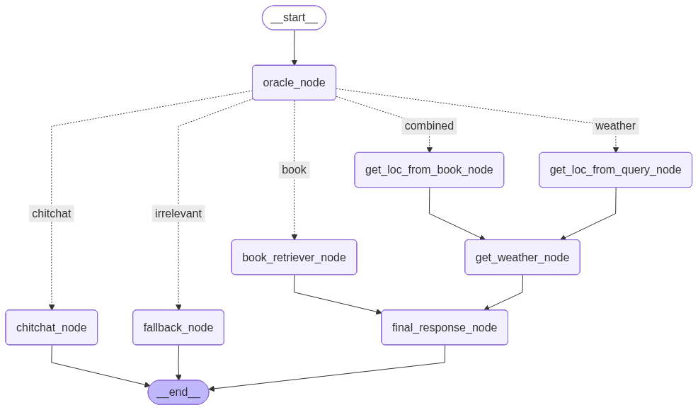

# Travel Planning Chatbot

## Project Overview
<div align="center">
  
</div>

WanderWords is a travel planning chatbot powered by FastAPI, ChromaDB, and Mistral AI. It provides travel-related answers and weather information based on Mark Twain's travels, with a simple web UI and chat history support.

## Setup Instructions

### Option 1: Using Docker (Recommended)

#### 1. Clone the repository
```bash
git clone <repo_url>
cd travel_planning_chatbot
```

#### 2. Set up environment variables
- Copy the example environment file:
  ```bash
  cp .env.example .env
  ```
- Edit `.env` and add your API keys:
  - `WEATHERAPI_KEY`: Your WeatherAPI key. You can get a free api key from  [Weatherapi.com](https://www.weatherapi.com/)
  - `MISTRAL_API_KEY`: Your Mistral AI key. You can get a free api key from [Mistral API Quickstart](https://docs.mistral.ai/getting-started/quickstart/)

#### 3. Build and run with Docker Compose
```bash
docker-compose up --build
```

#### 4. Access the UI
- Open your browser and go to `http://localhost:3000` 

### Option 2: Local Development

#### 1. Clone the repository
```bash
git clone <repo_url>
cd travel_planning_chatbot
```

#### 2. Create a virtual environment
```bash
python -m venv .venv
source .venv/bin/activate  # On Windows: .venv\Scripts\activate
```

#### 3. Install dependencies
```bash
pip install -e .
```

#### 4. Set up environment variables
- Copy the example environment file:
  ```bash
  cp .env.example .env
  ```
- Edit `.env` and add your API keys (same as Option 1)

#### 5. Run ChromaDB separately
```bash
docker run -p 8000:8000 chromadb/chroma
```

#### 6. Run the application
```bash
python app.py
``` 

## API Keys
- **WEATHERAPI_KEY**: Used to fetch weather information for travel locations.
- **MISTRAL_API_KEY**: Used for Mistral AI language model responses.

## Notes
- Do not commit your `.env` file with real API keys to the repository.
- Always use `.env.example` as a template for environment setup.
- If you have any questions, refer to this README or contact the developer (Svetlana Maslenkova, maslenkova.lana@gmail.com).

## Chatbot Structure
Here is the overview of the underlying graph structure of the chatbot:


---

